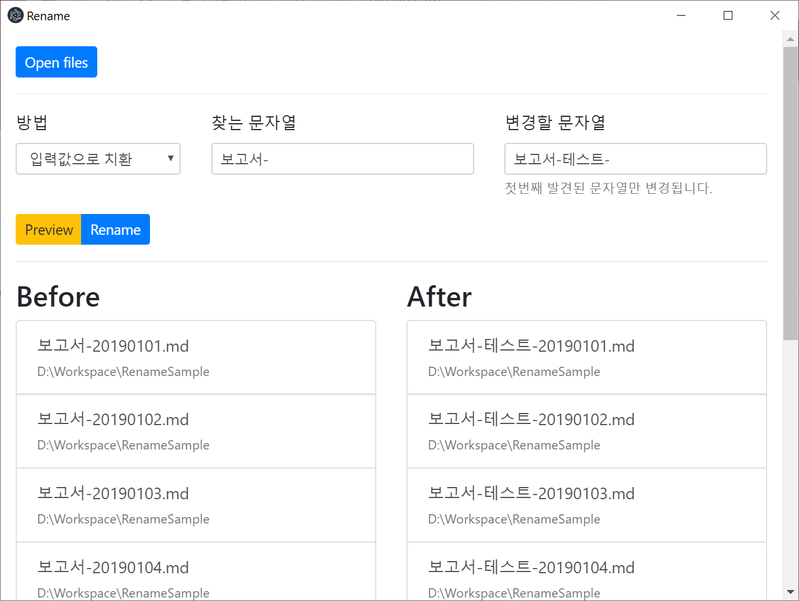
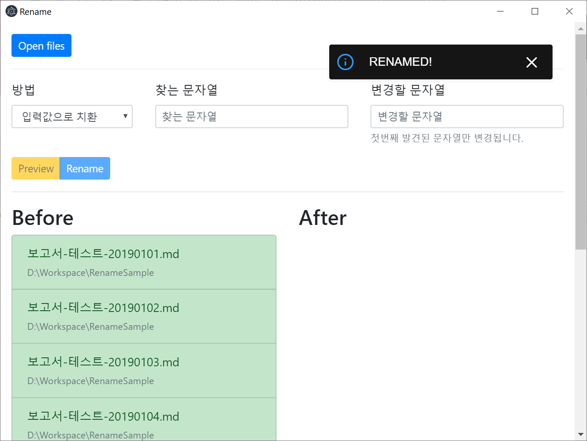
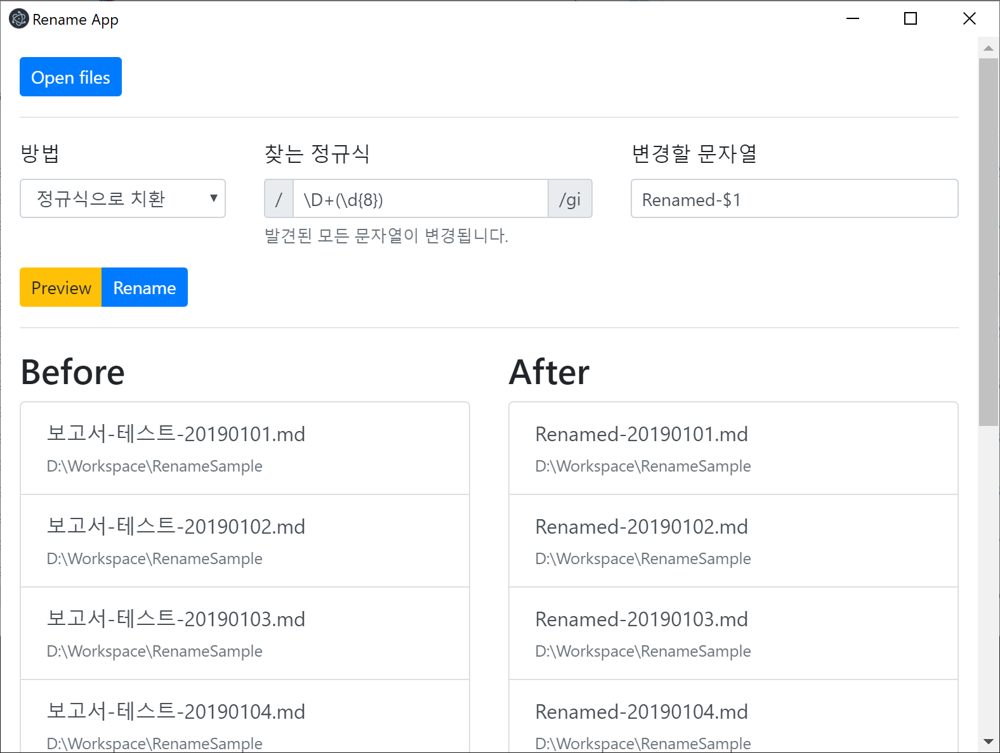
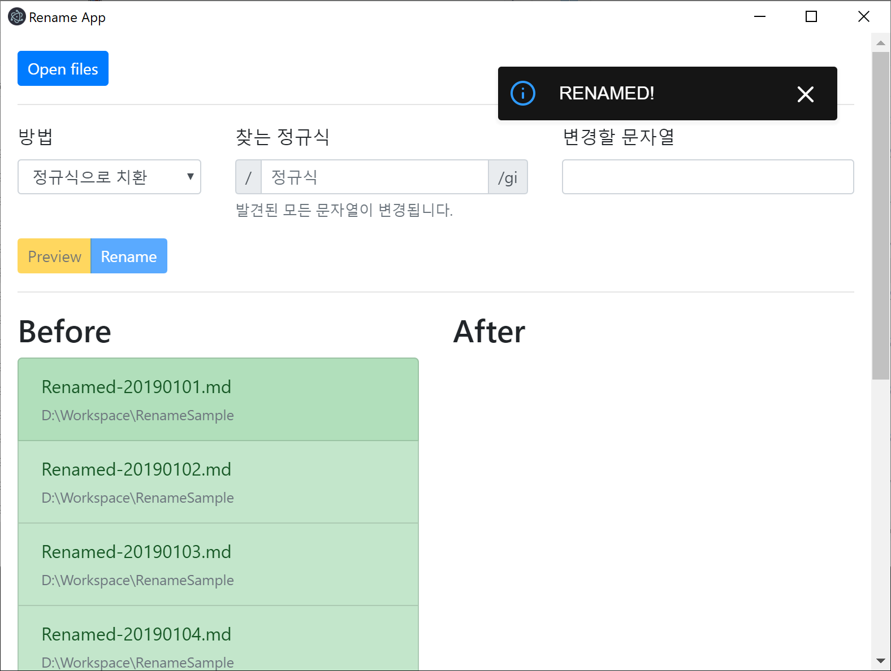

# Rename App

일정한 규칙으로 관리되는 파일의 이름을 일괄 변경하기 위해 작성한 응용프로그램입니다.

## 변경방법

파일 이름 일괄변경에 지원되는 방법은 아래와 같습니다.

-   입력값으로 치환
-   앞에 추가
-   뒤에 추가
-   정규식으로 치환

### 입력값으로 치환

파일이름에서 찾을 문자열에 입력된 문자열을 찾아서 변경할 문자열에 입력된 문자열로 치환합니다.

### 앞에 추가

파일이름의 앞에 추가할 문자열에 입력된 문자열을 삽입합니다.

### 뒤에 추가

파일이름의 뒤에 추가할 문자열에 입력된 문자열을 삽입합니다.

### 정규식으로 치환

파일이름에서 찾는 정규식에 입력된 패턴을 찾아서 변경할 문자열에 입력된 문자열로 치환합니다.

## 사용방법

1.  Open files 버튼을 클릭하고 이름을 일괄 변경할 파일들을 선택합니다.
2.  변경 방법을 선택합니다.
3.  변경할 문자열 또는 추가할 문자열을 입력합니다.
4.  Preview 버튼을 클릭해서 미리보기를 확인합니다.
5.  Rename 버튼을 클릭해서 파일이름을 변경합니다.









> 정규식은 [자바스트립트의 정규식 가이드](https://developer.mozilla.org/ko/docs/Web/JavaScript/Guide/%EC%A0%95%EA%B7%9C%EC%8B%9D)를 참조하십시오.

## 설치파일

[Release 페이지](https://github.com/bbonkr/renameapp/releases/latest) 에서 최신 설치파일을 얻을 수 있습니다.

~~macos 에서 동작 오류를 발견해서 macos 실행파일은 제공하지 않습니다.~~ [mac-fix-1 브랜치](https://github.com/bbonkr/renameapp/tree/macos-fix-1)에서 해결되었습니다.

> Macos 에서의 파일이름 처리때문에 발생한 문제이고, 파일이름 문자열을 [String.prototype.normalize()](https://developer.mozilla.org/en-US/docs/Web/JavaScript/Reference/Global_Objects/String/normalize) 함수로 해결할 수 있습니다.
>
> 한글로 된 파일이름을 콘솔에 출력하면 macos 에서는 `테스트.txt` 로 보이지만, 다른 OS에서는 `ㅌㅔㅅㅡㅌㅡ.txt`와 같이 출력됩니다.
>
> ```js
> const path = require('path');
>
> let extension = path.extname(somepath);
> let filename = path.basename(somepath, extension);
> console.log(filename); // ㅌㅔㅅㅡㅌㅡ
> filename = filename.normalize();
> console.log(filename); // 테스트
> ```
>
> 참조 <small>관련된 사항은 아니지만 흥미로운 주제라 링크를 남깁니다</small>
>
> -   [JavaScript has a Unicode problem](https://mathiasbynens.be/notes/javascript-unicode)
> -   [Unicode filenames in Windows vs. Mac OS X](https://superuser.com/questions/999232/unicode-filenames-in-windows-vs-mac-os-x)

## 저장소

[GitHub: renameapp](https://github.com/bbonkr/renameapp) 사이트에서 전체 내용을 확인할 수 있습니다.

[Issue 페이지](https://github.com/bbonkr/renameapp/issues)에서 이슈를 등록하실 수 있습니다.

[PR <small>Pull Request</small>](https://github.com/bbonkr/renameapp/pulls)은 언제나 환영합니다.

## 빌드

Rename app 응용프로그램은 [Electron](https://electronjs.org/)을 기반으로 UI 는 [react](https://reactjs.org/) 와 [bootstrap](https://getbootstrap.com/) 을 사용하여 작성되었습니다.

직접 빌드해서 사용하시려면 아래와 같이 진행하십시오.

### 의존 npm 패키지를 설치

```bash
$ npm install
```

또는

```bash
$ yarn
```

### Electron Renderer 빌드

```bash
$ npm run build:prod
```

또는

```bash
$ yarn build:prod
```

### 실행

```bash
$ npm run start
```

또는

```bash
$ yarn start
```

### 실행파일 빌드

#### 윈도우즈 실행파일

```bash
$ npm run pack:win
```

또는

```bash
$ yarn pack:win
```

#### 맥오에스 실행파일

```bash
$ npm run pack:mac
```

또는

```bash
$ yarn pack:mac
```
